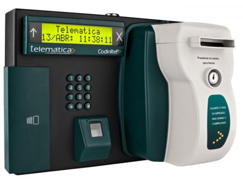

# AUTOMATION REP 2000 IP  

> Pensando em facilitar a compatibilidade do computador com o relógio de ponto REP 2000 elaborei uma aplicação que automatiza a tarefa de adicionar o IP do aparelho ao navegador.

### Ajustes e melhorias

O projeto ainda está em desenvolvimento e as próximas atualizações serão voltadas para as seguintes tarefas:

- [x] Tarefa 1 - Elaborar Script de ações que o computador deverá realizar para adicionar o Ip ao navegador
- [x] Tarefa 2 - Adicionar bibliotecas responsáveis pela automação do projeto 
- [x] Tarefa 3 - Programar o Script em Python
- [ ] Tarefa 4 - Transformar o projeto em um arquivo executável
- [ ] Tarefa 5 - Testar a aplicação em diferentes equipamentos

## 💻 Pré-requisitos

Antes de começar, verifique se você atendeu aos seguintes requisitos:

- Python instalado em seu computador
- Devidas bibliotecas instaladas
- Equipamento REP 2000

## 🤝 Colaboradores

Projeto independente criado por mim: 

https://www.linkedin.com/in/f%C3%A1bio-teixeira-479919238/

